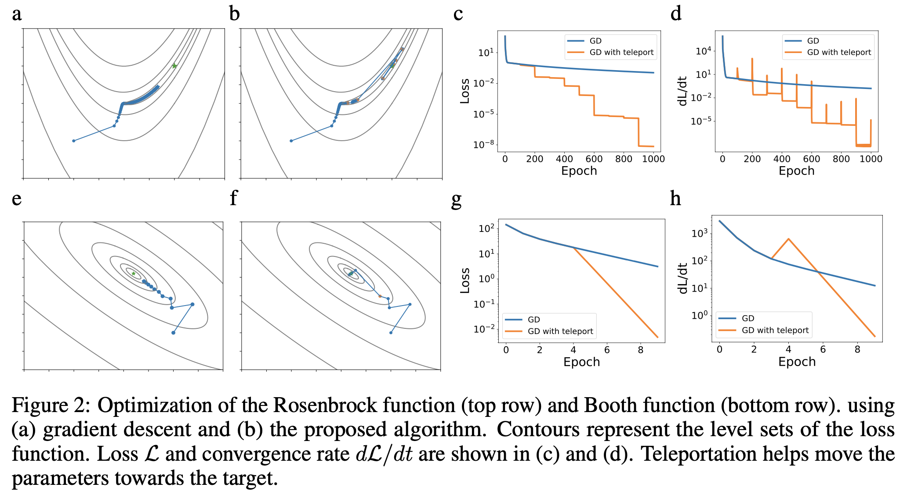

I would like to *explicitely* mention that although I have implemented the paper, I am _not_ related to any of the paper's authors.

# Symmetry Teleportation for Accelerated Optimization

I implement* the https://arxiv.org/abs/2205.10637 paper (Symmetry Teleportation for Accelerated Optimization) in Tensorflow, and find fruitful results using a slightly alternate teleportation scheme in application with the Fashion-MNIST dataset. The image provided shows general training results as a result of teleportation for highly non-convex functions.

##### A personal synopsis:

The loss function with respect to weight layers in deep neural-nets contain symmetries, these symmetries can be exploited via group invariant (equi-energy contour preserving) actions under specific conditions. These priorly unexploited symmetries allow for the model to improve convergence speeds by effectively teleporting its weights in a way as to maintain it's output, yet get itself out of non-optimal troughs and poorly learnable environments, hence improving the speed at which it learns. The paper focuses on using lie groups to allow for gradient ascent for optimising teleportations, however I go a different way by samplying suitable teleports randomly and choosing the best one. I don't think mine is optimal, but it does allow for a wider variety of teleports to occur, so there's some trade-off there.

In my tests with a small Fashion-MNIST dataset and feed-forward neural net of size 64, 64, 10, I saw ~10% leaps in training improvement for each teleport; and further vastly improving the convergence. Due to not using gradient ascent, the paper's analysis on achieving 2nd order convergence speeds does not apply here - and a similar analysis on my method is not provided.

The main advantage to using teleportation instead of simply having more epochs in training is in the ability to get out of highly non-convex environments.

##### Further comments

1) It would be nice knowing the effects of teleportation norm in relation to teleportation effectiveness - as well as which norm makes the most sense.
2) What theoretical symmetries could be exploited for varying loss funcs?
